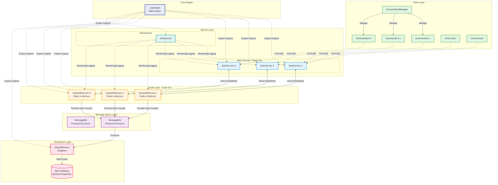

# CppGameServer

A high-performance, scalable game server framework built with C++17, designed using Microservice Architecture (MSA) principles for modern online gaming applications.

## 🎮 Overview

CppGameServer is a portfolio-level game server implementation that demonstrates professional-grade architecture for handling multiple concurrent clients in real-time gaming scenarios. The server provides a robust foundation for Unity, Unreal Engine, and other game clients to connect and communicate efficiently.

## 🏗️ Architecture

The server follows a Microservice Architecture (MSA) pattern with the following core components:



### Core Components

#### 🛠️ CppToolkit (Core Engine)
The foundation library providing essential utilities:
- **Network**: High-performance networking layer with TCP/UDP support
- **ThreadPool**: Efficient thread management for concurrent operations
- **Utilities**: Common utilities and helper functions
- **Database**: Database abstraction layer

#### 🎯 MainService
- Handles direct client connections and real-time communication
- Manages game world state and player interactions
- Directly interfaces with Redis for fast data access
- Horizontally scalable to handle increased load

#### 💾 CacheDBService
- Integrated Redis in-memory database service
- Provides fast data caching and retrieval
- Periodically syncs data to persistent storage via Message Queue
- Supports horizontal scaling for distributed caching

#### 🗄️ MainDBService
- Singleton service for persistent data storage
- Consumes data from Message Queue
- Performs batch writes to main database (MySQL/PostgreSQL)
- Ensures data durability and consistency

#### 📬 MessageMQ
- Asynchronous message broker for inter-service communication
- Implements Producer/Consumer pattern
- Ensures reliable data transfer between services

#### 🔧 InfraService
- Centralized monitoring and logging
- Service health checks and metrics collection
- System-wide configuration management

#### 🎮 DummyClient & DummyClientManager
- Test clients for load testing and demonstration
- Simulates real game client behavior
- Managed centrally by DummyClientManager

## 🚀 Features

- **Microservice Architecture**: Modular, scalable design
- **High Performance**: Built with C++17 for optimal performance
- **Cross-Platform**: Supports Windows, macOS, and Linux
- **Real-time Communication**: TCP/UDP support for gaming protocols
- **In-Memory Caching**: Redis integration for fast data access
- **Horizontal Scaling**: Services can scale independently
- **Message Queue**: Asynchronous inter-service communication
- **Monitoring**: Built-in service monitoring and logging

## 📋 Requirements

- C++17 compatible compiler
- CMake 3.20 or higher
- vcpkg (for dependency management)
- Redis
- MySQL
- Message Queue system (RabbitMQ, TCP/IP Message Module)

## 🔧 Installation

### 1. Clone the repository
```bash
git clone https://github.com/mgee044/CppGameServer.git
cd CppGameServer
```

### 2. Install dependencies
```bash
TODO
```

### 3. Build the project
```bash
# Windows
./build.bat

# macOS/Linux
./build.sh
```

## 🏃‍♂️ Running the Server

### Start Core Services
```bash
TODO
```

### Run Test Clients
```bash
# Start Dummy Client Manager
./build/DummyClientManager/DummyClientManager

# Or run individual dummy clients
./build/DummyClient/DummyClient --server localhost:8001
```

## 📁 Project Structure

```
CppGameServer/
├── CppToolkit/           # Core engine library
│   ├── Network/          # Networking components
│   ├── ThreadPool/       # Thread management
│   ├── Utilities/        # Common utilities
│   └── Database/         # Database abstraction
├── MainService/          # Client connection service
├── CacheDBService/       # Redis cache service
├── MainDBService/        # Persistent storage service
├── CommonMessageMQ/      # Message queue service
├── InfraService/         # Infrastructure service
├── DummyClient/          # Test client
├── DummyClientManager/   # Test client manager
├── build/                # Build output directory
├── cmake/                # CMake configuration
├── vcpkg.json           # Dependency manifest
├── build.bat            # Windows build script
├── build.sh             # Unix build script

```

## 🤝 Contributing

1. Fork the repository
2. Create your feature branch (`git checkout -b feature/AmazingFeature`)
3. Commit your changes (`git commit -m 'Add some AmazingFeature'`)
4. Push to the branch (`git push origin feature/AmazingFeature`)
5. Open a Pull Request

### Coding Conventions

- **Functions**: `lowercase_snake_case()`
- **Classes/Structs**: `PascalCase`
- **Member variables**: `member_variable_`
- **Tab size**: 4 spaces
- **Braces**: New line style
- Use trailing return types
- Return `std::tuple<bool, std::optional<std::string>>` for error handling

## 📊 Performance

- Supports 10,000+ concurrent connections
- Sub-millisecond latency for cache operations
- Horizontal scaling capabilities
- Efficient thread pooling for CPU optimization

## 🔐 Security Features

- Packet encryption support
- DDoS protection mechanisms
- Input validation and sanitization
- Secure authentication system (planned)

## 🗺️ Roadmap
- [ ] Real-time chat service
- [ ] Docker containerization
- [ ] Kubernetes deployment configuration

## 📝 License

This project is licensed under the MIT License - see the [LICENSE](LICENSE) file for details.

## 👥 Authors

- **mgee044** - *Initial work* - [mgee044](https://github.com/mgee044)
- **email** - mgee044@naver.com

## 🙏 Acknowledgments

- Built on top of modern C++ best practices
- Inspired by industry-standard game server architectures
- Special thanks to the open-source community

---

For more detailed documentation, please refer to the [Wiki](https://github.com/mgee044/CppGameServer/wiki).
